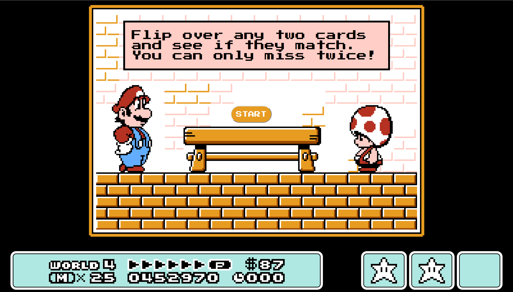
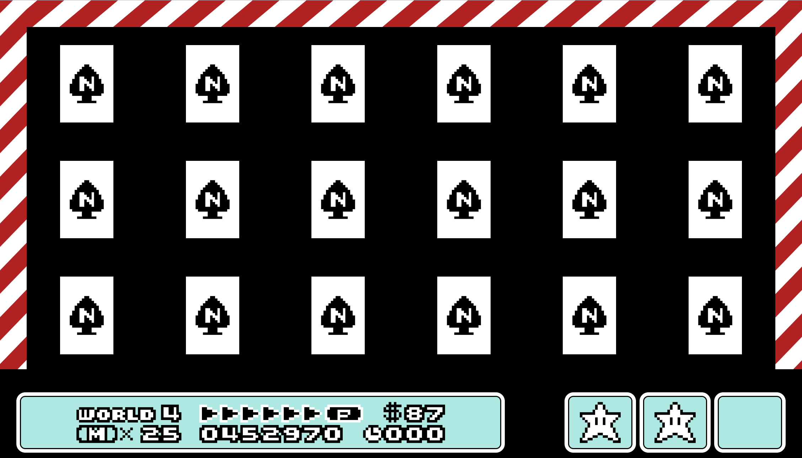
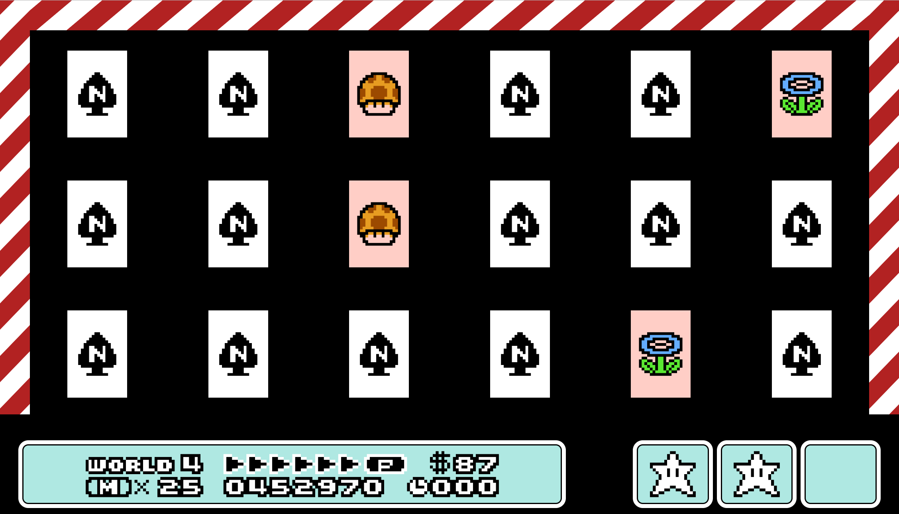

## Mario 3 Match Game

This game is based off the the N-Spade match game found in Super Mario Bros 3 for the NES and uses assets found in that game. This is in no way affiliated with Nintendo, it was just a fun way for me to begin exploring React and Hooks.

Deployed: https://bmc-mario3-match.herokuapp.com/

## Technologies

This app was built with React as an exercise to learn the new hooks feature. It uses React Router DOM and Styled Components.

## Images

## Future Work

- Animated transition between Start Screen and Game Board
- Animate card flip
- Implement Game Over and Win conditions
- Animate text on Start Screen